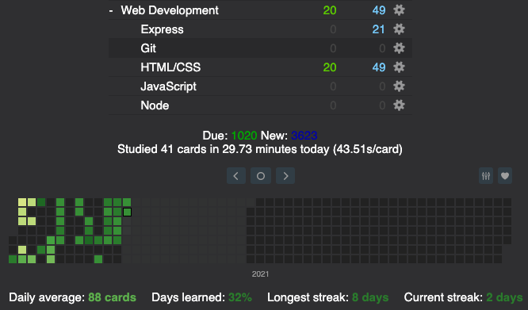

# My Awesome Project

Hey everyone, welcome to my Anki deck. This is where I upload all of my learnings from 100Devs and put it into an Anki deck where everyone else can use it to aid their learning.

## How It's Made:

**Tech used:** Anki

I have broken this deck down into different topics that we learned at 100Devs. Topics such as:

1. HTML/CSS --> A lot of these cards are made from the Shay Howe readings [here](https://learn.shayhowe.com/)
2. JavaScript --> These cards are made from Eloquent JavaScript and Javascript.info
3. Git --> Youtube tutorial [here](https://www.youtube.com/watch?v=SWYqp7iY_Tc) and this super hard reading [here](https://jwiegley.github.io/git-from-the-bottom-up/)
4. Node --> From Mosh's youtube tutorial [here](https://www.youtube.com/watch?v=TlB_eWDSMt4)
5. Express --> Also from Mosh's youtube tutorial [here](https://www.youtube.com/watch?v=pKd0Rpw7O48)

## Optimizations

I follow these general rules to help me make efficient flash cards. A lot of these rules are derived from Supermemo's 20 rules for memorization [here](https://www.supermemo.com/en/archives1990-2015/articles/20rules).

1. I keep my cards modular, and only cover 1 little piece of information at a time.
2. I include lots of images in my Anki cards, as I find that it really helps me solidify all of that information.
3. In that context, I also add a lot of extra information in my Anki card so that I know why memorizing a specific piece of information is important and how it fits in the big picture.

## Lessons Learned:

I think one of the weaknesses with this Anki deck is that I have made it. For people who are learning from this Anki deck and who may not necessarily have the same knowledge experience as me, it may be hard to understand the context of where this information is coming from. However, I do hope that this Anki deck continues to stay relevant for the software engineers at 100Devs.

I will try to add a google form in the future if people request it. This way all of you can suggest changes to the Anki deck, and I can update the Anki deck at set intervals. Please let me know if there is interest with regards to this.

## Examples:

Take a look at these couple examples that I have in my own portfolio:

**Vidya:** https://github.com/abhisheknage/Vidya

**Slot Machine:** https://github.com/abhisheknage/100devs-slot-machine

**Calculator:** https://github.com/abhisheknage/100devs-calculator
